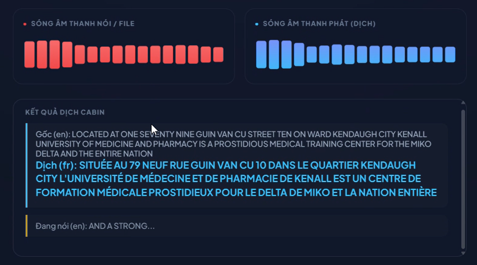

<h2 align="center">
  Author: Huynh Thanh Phong (ReoRioll)
</h2>

   Computer Science of College of Information and Communication Technology of Can Tho University (Course 48) 

<b>Researchs:</b> Artificial Intelligence in Education - Mathematics in Deep Learning and Machine Learning 

<h4 align="center">
  <mark><b><b>Name Project:</b></b> </mark> Multilingual translation with S2ST  
</h4>

   <b>Presional link Information</b>

&nbsp;&nbsp;&nbsp;&nbsp;&nbsp;&nbsp;&nbsp;&nbsp;&nbsp;&nbsp;&nbsp;&nbsp;&nbsp;&nbsp;&nbsp;&nbsp;&nbsp;&nbsp;
Facbook: https://www.facebook.com/huynh.thanh.phong.561667  

&nbsp;&nbsp;&nbsp;&nbsp;&nbsp;&nbsp;&nbsp;&nbsp;&nbsp;&nbsp;&nbsp;&nbsp;&nbsp;&nbsp;&nbsp;&nbsp;&nbsp;&nbsp;
Kaggle: https://www.kaggle.com/reorioll  

&nbsp;&nbsp;&nbsp;&nbsp;&nbsp;&nbsp;&nbsp;&nbsp;&nbsp;&nbsp;&nbsp;&nbsp;&nbsp;&nbsp;&nbsp;&nbsp;&nbsp;&nbsp;
Youtobe: https://www.youtube.com/@ReoRioll-2304CICTCTU  

 

<h4 align="center">
  Available at your primary URL <mark> https://multilingual-translation-with-s2st.onrender.com </mark>
</h4>

  
   
  <i>Ảnh giao diện hệ thống dịch thuật đa ngôn ngữ</i>

